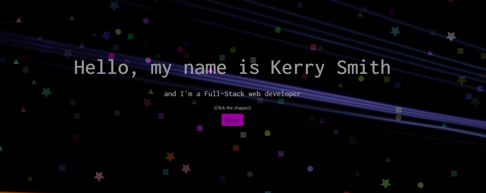

[](https://www.contributor-covenant.org/version/2/0/code_of_conduct/)

# **Kerry Smith's portfolio**

# Table of Contents

- [**KS Portfolio**](#portfolio)
- [Table of Contents](#table-of-contents)
- [Project Description](#project-description)
- [Installation](#installation)
- [Usage](#usage)
- [Tests](#tests)
- [License](#license)
- [Contributions](#contributions)
- [Questions](#questions)
- [Developers](#developers)

# Project Description

Custom made portfolio page made with React to showcase some of my projects that I've done solo and with collaborators. 

# Installation

If you would like to use as a template.

```sh 
git clone
```

# Usage

The application is located here: [Kerry Smith portfolio](https://portfolio-kerry-smith.herokuapp.com/portfolio/). Please enjoy my work!

# How to use

Clone then run first cmd then once that is finished run second cmd 

```sh 
npm i
```
```sh 
npm start
```

# License

Licensed under the [MIT License](https://spdx.org/licenses/MIT.html).

# Contributions

This project is currently not accepting any contributions.

# Questions

If you have any questions, please contact the project developers by clicking on the email addresses listed below.

# Developer


Kerry Smith  
[Github](https://github.com/Kerry-Jr)  
<kerrysfs@gmail.com>



